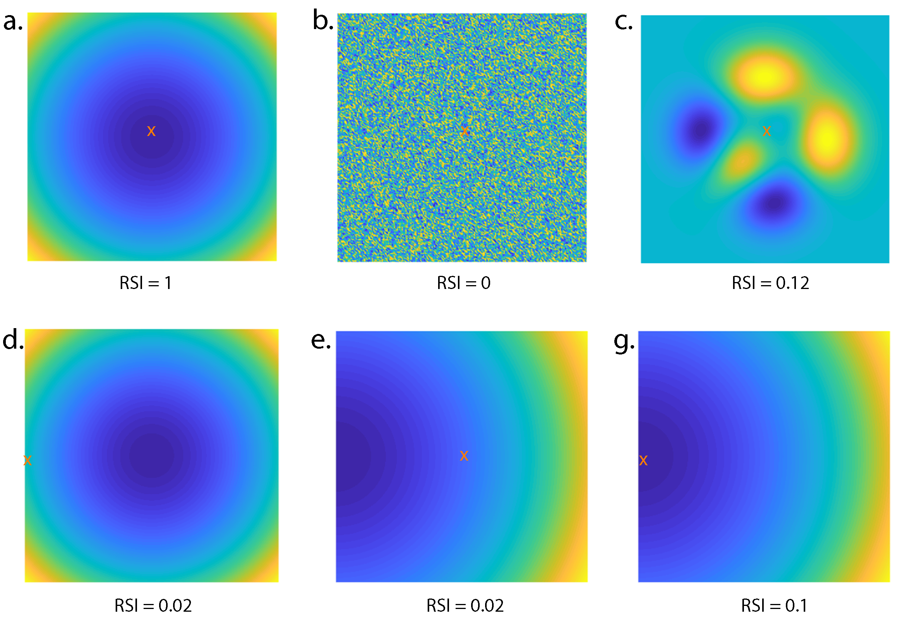

# RSI
Matlab codes for computing Radial symmetry Index (RSI).

# Introduction: 
The Radial Symmetry Index (RSI) quantifies the rotatial symmetry in images by assigning a value between 0 and 1, with 0 indicating no symmetry and 1 indicating perfect symmetry. Physically, RSI computes the variance in the magnitude of the data at every radial location and maps this variance between 0 and 1 using a sigmoid function. 

# Test Cases: 

Fig: RSI values for 6 test cases for the default settings. 'X' marks the location about which RSI is computed. (a) Height contours of a sphere - Image with perfect radial symmetry (b) Random noise (c) Contours of peak function in Matlab (d) Off center RSI for height contours of a sphere - Image with perfect radial symmetry (e) RSI calculated at image center for off center contours of a sphere (f) Off center RSI for off center contours of a sphere.  
